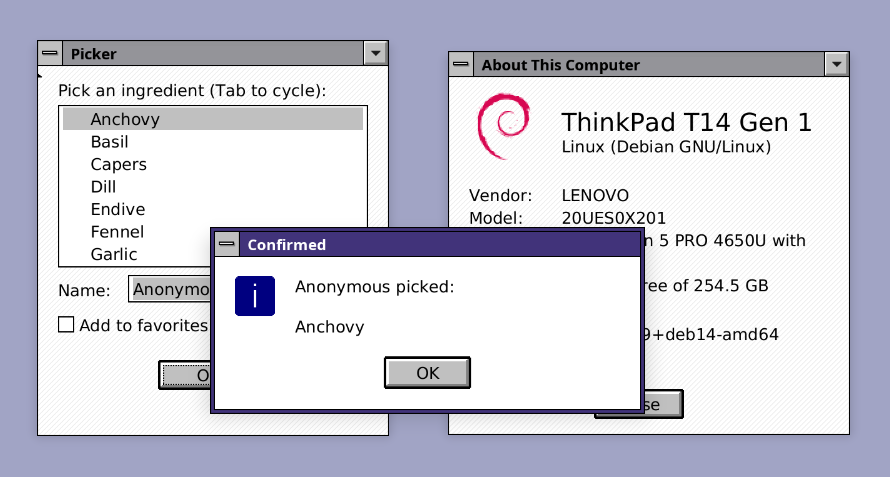

# Saudade

[](https://github.com/roblillack/saudade/actions/workflows/ci.yml)
[](https://crates.io/crates/saudade)
[](https://docs.rs/saudade)

A minimal, retained-mode GUI library for small Windows 3.1–styled utilities
written in Rust. Built on `winit` + `softbuffer` with `fontdue` + `fontdb`
for text — no GPU, no browser engine, no mobile support, or complex developer
tooling.



Saudade exists to make tiny dialogs and tools (about boxes, system
viewers, simple text editors, mini control panels) that look like they
fell out of 1992 while staying portable, density-independent, and crisp
on modern displays.

Applications built with Saudade pair exceptionally well with my Wayland
window manager [Canoe](https://github.com/roblillack/canoe), but will work
on any UNIX (Wayland/X11) or Mac system.

These are some apps using Saudade: [Git Journey](https://github.com/roblillack/gitj), [retrocalc](https://github.com/roblillack/retrocalc), [retrofetch](https://github.com/roblillack/retrofetch), and [RetroSaurus](https://github.com/roblillack/RetroSaurus)

## Status

Pre-1.0, intentionally small. The current widget set is enough to
assemble small single-window utilities. There is currently no documentation
apart from this huge ~~braindump~~ README.

Reference apps live under `examples/`. Run any of them with
`cargo run --example <name>`:

| Example         | What it shows                                                                                                                                                                                                                                                                                                                                                                                    |
| --------------- | ------------------------------------------------------------------------------------------------------------------------------------------------------------------------------------------------------------------------------------------------------------------------------------------------------------------------------------------------------------------------------------------------ |
| `notepad`       | Editor window with menu bar (`MenuBar`, `TextEditor`); File → Open / Save As drive a `FileDialog`.                                                                                                                                                                                                                                                                                                |
| `filer`         | Filesystem browser using `List` with folder/file icons. Drag an entry out of the window to drop it onto another app (drag *source* via `EventCtx::start_drag`; Wayland only).                                                                                                                                                                                                                       |
| `dnd`           | A drop zone that highlights while a file drag hovers and lists the paths dropped onto it. Demonstrates OS file drag-and-drop (`DragEnter` / `DragMove` / `DragLeave` / `Drop`) across macOS, Windows, X11, and Wayland.                                                                                                                                                                            |
| `picker`        | Pick-an-item dialog: `List` + buttons + `Dialog`, with Tab/Shift+Tab focus cycling.                                                                                                                                                                                                                                                                                                              |
| `focus_form`    | `FocusLabel` buddy labels: Alt+letter mnemonics jump focus to the next field.                                                                                                                                                                                                                                                                                                                    |
| `counter`       | [7GUIs](https://eugenkiss.github.io/7guis/) task 1 — a `Label` field and a `Button`.                                                                                                                                                                                                                                                                                                             |
| `temperature`   | 7GUIs task 2 — two `TextInput`s converting Celsius ↔ Fahrenheit live.                                                                                                                                                                                                                                                                                                                            |
| `flight_booker` | 7GUIs task 3 — a `Dropdown` picks the flight type and reactively enables / disables the return-date field and the Book `Button`.                                                                                                                                                                                                                                                                 |
| `timer`         | 7GUIs task 4 — a `ProgressBar` gauge, a duration `Slider`, and a reset `Button`.                                                                                                                                                                                                                                                                                                                 |
| `crud`          | 7GUIs task 5 — a `List` as a live, prefix-filtered database view with Create / Update / Delete `Button`s that enable themselves reactively.                                                                                                                                                                                                                                                      |
| `circle_drawer` | 7GUIs task 6 — a custom canvas (no circle primitive: midpoint outlines, span-filled disks) with hover selection, a right-click menu, a real modal dialog (`Modal`) hosting the diameter `Slider`, and snapshot undo/redo.                                                                                                                                                                        |
| `cells`         | 7GUIs task 7 — a scrollable A–Z / 0–99 spreadsheet `Grid` (built on `ScrollBar` + `TextInput`) with a formula engine: cell refs, `+ - * /`, ranges, `SUM`/`AVG`/…, reactive recompute and cycle detection.                                                                                                                                                                                       |
| `patterns`      | Previews the window background patterns (`none`, `solid`, `dots`, `lines`, `diagonal`, `cross-stitch`): press `p` to cycle the pattern and `c` to cycle the color. Every app draws one behind its widgets — default `superlight` `diagonal`, overridable with `SAUDADE_WINDOW_PATTERN` / `SAUDADE_WINDOW_PATTERN_COLOR` (e.g. `SAUDADE_WINDOW_PATTERN=dots SAUDADE_WINDOW_PATTERN_COLOR=light`). |
| `scaling`       | Previews widgets at an arbitrary logical→physical scale via `Painter::draw_scaled`: a `Slider` and preset `Button`s (1.0x / 1.25x / … / 3.0x) drive a "preview scale" — starting at the display's OS scale — that a small panel of real widgets (`TextInput`, `Dropdown`, `Checkbox`, `Button`s, `ProgressBar`) redraws at, plus a "zoom in 2x" `Checkbox` that magnifies the result. The window resizes itself (via `EventCtx::request_window_size`) to fit the preview at the chosen scale. The window's own (OS-owned) scale is never touched.                                  |
| `svg`           | Compares `include_svg!` (SVG baked to polygons at compile time, filled at runtime — no SVG crate in the binary) against `include_str!` + `resvg` (parse + rasterize at runtime). Draws six icons both ways for a side-by-side fidelity check and prints a micro-benchmark to the console (run with `--release`). Needs `resvg` only as a dev-dependency, for the comparison.                                                                                                                                                |
| `chrome`        | Renders an "about box" offscreen and wraps it in Canoe-style window chrome (title bar, frame, drop shadow on a teal desktop) via `MockBackend::render_framed`, writing one PNG per frame style (`Resizable` / `Fixed` / `Dialog`). Opens no window — it generates screenshots.                                                                                                                    |

```console
$ cargo run --example notepad        # or: filer, dnd, picker, counter, temperature,
                                     #     flight_booker, timer, crud, circle_drawer,
                                     #     cells, patterns, scaling, svg
```

Saudade was extracted from
[_retrofetch_](https://github.com/roblillack/retrofetch), whose about-box
dialog (`Container` + `Label` + `Button` + `Image` + `Bevel`) was the
original demo; that project now lives in its own repository.

## At a glance

```rust
use saudade::*;

fn main() {
    let root = Container::new(220, 100)
        .with_background(Color::WHITE)
        .with_border(Color::BLACK)
        .add(Label::new(Rect::new(20, 20, 180, 16), "Hello, saudade!"))
        .add(
            Button::new(Rect::new(70, 60, 80, 24), "OK")
                .default(true)
                .on_click(|cx| cx.close()),
        );

    App::new(WindowConfig::new("Hello", 220, 100), root).run();
}
```

## Adding Saudade to your project

Saudade is on [crates.io](https://crates.io/crates/saudade); add it the
usual way:

```console
$ cargo add saudade
```

or list it directly in your `Cargo.toml`:

```toml
# Cargo.toml
[dependencies]
saudade = "0.5.0"
```

The reference apps under `examples/` are plain Cargo examples built against
this crate; see those for a working setup, and run them with
`cargo run --example <name>`.

## Design philosophy

Saudade follows a small set of architectural principles:

- widgets are ordinary Rust values implementing the `Widget` trait
- events are typed Rust enums — no integer message IDs
- widgets request repaint / window-close / focus via a small `EventCtx`
- the runtime drives `winit` and writes pixels through `softbuffer`
- widgets paint in **logical pixels**; the library handles DPI

The mental model is closer to "a typed, ownership-safe GUI runtime" than
to an object-oriented UI framework.

## Module map

| Module   | Contents                                                                                                                                                                                                 |
| -------- | -------------------------------------------------------------------------------------------------------------------------------------------------------------------------------------------------------- |
| geometry | `Point`, `Size`, `Rect`, `Color`                                                                                                                                                                         |
| event    | `Event`, `DragData`, `MouseButton`, `Key`, `NamedKey`, `Modifiers`, `EventCtx`                                                                                                                           |
| theme    | `Theme`, default `Theme::windows_31()` palette                                                                                                                                                           |
| painter  | `Painter` — drawing primitives + Win 3.1 chrome helpers                                                                                                                                                  |
| svg      | `SvgImage`, `SvgPolygon`, `FillRule` + the `include_svg!` macro — compile-time vector icons                                                                                                              |
| font     | `Font` — system font lookup + glyph rasterization                                                                                                                                                        |
| widget   | `Widget` trait (paint / event / focus / overlay hooks)                                                                                                                                                   |
| widgets  | `Container`, `Column`, `Row`, `Label`, `FocusLabel`, `Button`, `Checkbox`, `Bevel`, `Image`, `MenuBar`, `Menu`, `MenuItem`, `ScrollBar`, `Slider`, `ProgressBar`, `List`, `Modal`, `Dialog`, `FileDialog`, `TextInput`, `TextEditor` |
| app      | `App`, `WindowConfig` — runtime entry point                                                                                                                                                              |
| mock     | `MockBackend`, `Snapshot` — offscreen rendering to a pixel buffer / PNG                                                                                                                                   |
| chrome   | `WindowChrome`, `WindowFrame` — Canoe-style title bar + frame for screenshots                                                                                                                             |

Everything user-facing is re-exported from the crate root; you generally
just `use saudade::*;`.

## Core types

### `Color`

Packed 32-bit ARGB. Helpers cover the Win 3.1 default palette:

```rust
Color::rgb(0x40, 0x40, 0x40);
Color::argb(0x80, 0x00, 0x00, 0xFF); // half-transparent blue
Color::BLACK;      Color::WHITE;
Color::LIGHT_GRAY; Color::MID_GRAY; Color::DARK_GRAY;
Color::NAVY;       Color::RED;
Color::GREEN;      Color::YELLOW;
Color::TRANSPARENT;
```

`Color::TRANSPARENT` is used by `Image` to mark "skip this pixel".

### `Point`, `Size`, `Rect`

```rust
let p = Point::new(10, 20);
let s = Size::new(60, 24);
let r = Rect::new(10, 20, 60, 24);

assert!(r.contains(Point::new(15, 25)));
assert_eq!(r.right(), 70);
assert_eq!(r.bottom(), 44);
let inset = r.inset(2); // shrinks by 2 px on every side
```

All coordinates are _logical_ pixels (i32). The library multiplies by the
OS-reported scale factor when drawing.

## Events

```rust
pub enum Event {
    PointerMove  { pos: Point },
    PointerDown  { pos: Point, button: MouseButton },
    PointerUp    { pos: Point, button: MouseButton },
    PointerLeave,
    Scroll       { pos: Point, delta_x: f32, delta_y: f32 },
    DragEnter    { pos: Point },              // a file drag entered the window
    DragMove     { pos: Point },              // …and moved (Wayland only)
    DragLeave,                                // …and left without dropping
    Drop         { pos: Point, data: DragData }, // files were dropped
    KeyDown      { key: Key, modifiers: Modifiers },
    KeyUp        { key: Key, modifiers: Modifiers },
    Char         { ch: char, modifiers: Modifiers },
    Tick,        // ~60 Hz while any widget wants_ticks()
}

pub struct DragData { pub paths: Vec<PathBuf> }

pub enum MouseButton { Left, Right, Middle }

pub enum Key {
    Named(NamedKey),  // editing / navigation keys
    Char(char),       // physical key as a logical character
}

pub enum NamedKey {
    Enter, Backspace, Delete, Tab, Escape, Space,
    Left, Right, Up, Down, Home, End, PageUp, PageDown,
}

pub struct Modifiers { pub shift: bool, pub control: bool, pub alt: bool, pub logo: bool }
```

`Event::position()` returns the cursor `Point` for positional events —
including `Scroll` and the positional drag events (`DragEnter`, `DragMove`,
`Drop`), so containers route them to the widget under the pointer — or `None`
for `PointerLeave`, `DragLeave`, and keyboard events.
`Event::is_keyboard()` distinguishes the three keyboard variants.

`Event` is `Clone` but not `Copy`: `Drop` owns a `DragData` (a `Vec` of paths).
Dispatch always passes `&Event`, so this costs nothing on the hot path — only a
widget that keeps a dropped payload pays for the clone.

`Scroll` carries the wheel / trackpad movement in document _lines_, positive
toward the content's end (`delta_y` down, `delta_x` right). One wheel notch is
three lines; trackpad pixel deltas become a fractional line count, which the
backends normalize so both kinds of scroll feed widgets the same units.
`ScrollBar`, `List`, and `TextEditor` all honor it; the latter two scroll
whenever the pointer is anywhere over the field, leaving the selection and
caret untouched.

`KeyDown` / `KeyUp` are for _keys_ — useful for Backspace, arrows, and
modifier-bearing shortcuts. `Char` is for _text input_ — what the
keyboard layout decided the user typed. The runtime suppresses `Char`
when a command modifier (Ctrl / Alt / Logo) is held so editors don't
ingest "\x01" for Ctrl+A; the matching `KeyDown` still fires.

`Modifiers::has_command()` is true if any of Ctrl / Alt / Logo is held.

### Drag and drop

Saudade receives **file drops from the OS** on every backend — drag files from
Finder / Explorer / your file manager onto a window and the runtime turns the
drag into the same typed events everything else uses:

| Event       | When                                            | Carries          |
| ----------- | ----------------------------------------------- | ---------------- |
| `DragEnter` | a file drag entered the window                  | `pos`            |
| `DragMove`  | the drag moved (Wayland only)                   | `pos`            |
| `DragLeave` | the drag left / was cancelled without dropping  | —                |
| `Drop`      | the files were released                         | `pos` + `DragData` |

A widget opts in by matching these in its `event` handler — there's no separate
trait method. `DragEnter` / `DragMove` / `Drop` carry a `pos` and route to the
widget under the cursor exactly like pointer events; `DragLeave` carries no
position and is broadcast to every widget (like `PointerLeave`), so any drop
target can clear a highlight. A drop target **must call `ctx.accept_drop()`**
while handling `DragEnter` / `DragMove` to declare it will take a drop there;
without it the runtime treats the widget as uninterested and the drag falls
through. That's also what tells the *source* app the spot is a valid target —
its drag cursor reflects it — so windows with no drop zone correctly read as
"no drop". A typical drop target accepts + highlights on `DragEnter`,
un-highlights on `DragLeave`, and consumes `data.paths` on `Drop`:

```rust
fn event(&mut self, event: &Event, ctx: &mut EventCtx) {
    match event {
        Event::DragEnter { .. } | Event::DragMove { .. } => {
            ctx.accept_drop();           // <- required to receive the drop
            self.hot = true;
            ctx.request_paint();
        }
        Event::DragLeave => { self.hot = false; ctx.request_paint(); }
        Event::Drop { data, .. } => { self.open_files(&data.paths); ctx.request_paint(); }
        _ => {}
    }
}
```

(On Wayland `accept_drop` accepts the drag offer per position; on the winit
backends the OS has already committed to the drop, so it's advisory there but
keeps drop targets portable.)

The **payload only arrives with `Drop`**, never with `DragEnter` / `DragMove`:
the platforms only let us read a drag's contents reliably once the user actually
drops (reading mid-hover can block on a source that withholds the data), so the
enter/move events are a presence-and-position signal and `Drop` delivers the
files.

Two per-backend caveats:

- **Position.** On Wayland the drag position is exact and `DragMove` tracks the
  pointer continuously, so per-widget routing during a drag works. On the winit
  backends (macOS, Windows, X11) winit reports no cursor position during a file
  drag — `DragEnter` / `Drop` use the last in-window pointer location and there
  is no `DragMove`, so treat the whole window as one drop zone there.
- **Paths only, copy only.** A drop currently resolves to local file paths
  (`text/uri-list` on Wayland; winit's `HoveredFile` / `DroppedFile`
  elsewhere). On Wayland we always accept the *copy* action, never move, so a
  drop never makes the source delete the user's file.

See `examples/dnd.rs` (`cargo run --example dnd`) for a working drop zone.

#### Dragging files out (Wayland only)

A widget can also be a drag **source** — start an OS drag carrying file paths so
another application can receive it — by calling `EventCtx::start_drag` once it
recognizes a press-then-move gesture:

```rust
fn event(&mut self, event: &Event, ctx: &mut EventCtx) {
    match event {
        Event::PointerDown { pos, button: MouseButton::Left } => self.arm(*pos),
        Event::PointerMove { pos } if self.moved_past_threshold(*pos) =>
            ctx.start_drag(DragData::from_paths([self.path.clone()])),
        Event::PointerUp { .. } => self.disarm(),
        _ => {}
    }
}
```

This is **Wayland-only**: winit exposes no API to *initiate* a drag on any of
its platforms (macOS, Windows, X11), so `start_drag` is a no-op there. The drag
offers `text/uri-list` and copies (never moves) the files. Receiving drops, by
contrast, works on every backend. See `examples/filer.rs` (`cargo run --example
filer`) — drag an entry out of the window onto another app.

### `EventCtx`

Inside an event handler, widgets receive a mutable `&mut EventCtx` and
can ask the runtime to do things:

```rust
pub struct EventCtx { /* opaque */ }

impl EventCtx {
    pub fn request_paint(&mut self);             // mark window dirty
    pub fn close(&mut self);                     // close the window after dispatch
    pub fn request_focus(&mut self);             // become the keyboard target
    pub fn release_focus(&mut self);             // drop keyboard focus
    pub fn request_window_size(&mut self, w: i32, h: i32); // resize the window
}
```

Widgets never poke at the runtime directly. The runtime collects the
requests after a dispatch completes and applies them all at once, which
keeps event handling deterministic and re-entrancy-free.

## Theme

```rust
pub struct Theme {
    pub background: Color,      // window / workspace fill
    pub face: Color,            // button / menu-bar face
    pub highlight: Color,       // light bevel edge
    pub shadow: Color,          // dark bevel edge
    pub border: Color,          // 1-px outer black border
    pub text: Color,
    pub disabled_text: Color,
    pub highlight_bg: Color,    // selected-item bg (Win 3.1: navy)
    pub highlight_text: Color,  // selected-item fg (Win 3.1: white)
    pub font_size: f32,
}
```

The default is `Theme::windows_31()`: white workspace, light-gray button
face, white top/left highlight, mid-gray bottom/right shadow, black outer
border, navy/white selection, 11pt text. Pass an alternative via
`App::with_theme(...)` if you want to skin the same widgets differently.

## Built-in widgets

All widgets implement `Widget` and own their own state. Coordinates are
always in logical pixels.

### Layout vs. absolute positioning

Saudade ships with two top-level container styles:

- **`Container`** — children are placed at absolute logical-pixel positions.
  This is what you want for _dialogs_ (about boxes, simple alerts) that
  have a fixed design size and shouldn't reflow. If the OS gives the
  window a larger buffer than the design, the runtime centers the
  Container and fills the surroundings with `theme.background`.
- **`Column`** — children are stacked top-to-bottom and _flex_ with the
  window. Each child is either `add_fixed(widget, height)` (takes a
  declared height) or `add_fill(widget)` (shares whatever space is left
  over). On every window resize, the runtime calls `layout` on the root
  widget; `Column` propagates that to its children, so a menu bar stays
  pinned to the top and a text editor below it grows with the window.

Widgets opt into layout by overriding `Widget::layout(&mut self, bounds:
Rect)`. Most box-shaped widgets do — `MenuBar`, `TextEditor`, `List`,
`ScrollBar`, `Row`, `Button`, `Checkbox` and `Label` all store the new rect
(and rebuild any cached geometry), so they reflow inside a `Column`/`Row` or
any container that propagates `layout`. Widgets that don't override `layout`
(e.g. `Bevel`, `Image`) keep the position they were given at construction —
which is exactly what `Container`'s children want.

```rust
// Notepad layout: menu bar pinned to the top, editor fills the rest.
// The runtime auto-focuses the first focusable widget (the editor) at
// startup, so the user can type immediately.
let root = Column::new()
    .with_background(Color::WHITE)
    .add_fixed(menu_bar, MENU_BAR_H)
    .add_fill(text_editor);
```

`Column` also handles capture, focus, accelerator routing, and the
overlay pass — same contract as `Container`.

- **`Row`** — the horizontal sibling of `Column`. Same `add_fixed(widget,
width)` / `add_fill(widget)` API, laying children left-to-right across the
  full height, with the same capture / focus / accelerator / Tab handling.
  Unlike `Column` it carries no overlay layer — keep modal dialogs on the
  top-level container so there's a single overlay owner.

Both `Column` and `Row` expose `focus_child(index)` to choose a non-default
initial focus target (e.g. focus a content list instead of a leading toolbar
field). Custom container widgets outside the crate can reuse Saudade's focus
protocol via `EventCtx::is_focus_requested` / `is_focus_released` /
`clear_focus_flags`.

### `Container`

A flat collection of widgets at absolute positions. The container handles:

- **hit testing** — pointer events go to the top-most child whose bounds
  contain the cursor;
- **pointer capture** — a child whose `captures_pointer()` returns true
  keeps receiving pointer events until it un-captures (used by `Button`
  and `MenuBar`);
- **keyboard focus** — clicking a focusable child makes it the keyboard
  target; keyboard events route there only;
- **focus cycling** — Tab and Shift+Tab walk forward / backward through
  focusable children, wrapping at either end. The container looks at
  each child's `focusable()` and calls `focus_first` on the new target,
  so wrapper widgets that delegate focus to a nested leaf are handled
  transparently;
- **accelerator routing** — keyboard events also go to any child whose
  `accepts_accelerators()` returns true (used by `MenuBar` to catch
  Alt+letter combos while a sibling holds focus);
- **overlay pass** — every widget's `paint_overlay` runs after every
  widget's regular `paint`, so popups (menus, tooltips) draw on top of
  siblings.

```rust
let root = Container::new(395, 305)        // size in logical pixels
    .with_background(Color::WHITE)         // optional fill
    .with_border(Color::BLACK)             // optional 1-px outer border
    .add(Label::new(Rect::new(20, 20, 120, 16), "Hello"))
    .add(Button::new(Rect::new(150, 50, 80, 24), "OK"));

// imperatively:
let mut root = Container::new(395, 305);
root.push(Label::new(Rect::new(20, 20, 120, 16), "Hello"));
```

The runtime calls `Widget::focus_first` on the root once the window is
ready, so a container that holds a `TextEditor` or `List` will hand it
keyboard focus automatically. Override the trait method to choose a
different initial target.

Add order matters: later widgets paint on top and are hit-tested first.

### `Label`

A box of text. A `Label` always occupies a rectangle; text is laid out from
the box's top-left corner. Inherits color and size from the active `Theme`
unless overridden.

```rust
Label::new(Rect::new(10, 10, 120, 16), "Plain label");
Label::new(Rect::new(10, 30, 120, 14), "Smaller").with_size(8.0);
Label::new(Rect::new(10, 50, 120, 16), "Red").with_color(Color::RED);
```

Text is multi-line and word-wrapped to the box automatically — no wrap
points to specify by hand. Explicit `\n` characters always start a new line,
and any line too wide for the box breaks at whitespace (a single word wider
than the box overflows rather than being split mid-word). Lines stack at the
font's natural line height.

```rust
Label::new(Rect::new(10, 10, 200, 60),
    "A longer paragraph that wraps across several lines, plus an\nexplicit break.");
```

Anything that extends past the box — horizontally or vertically — is clipped
to its bounds, so a label never paints outside the rectangle it was given.
Placed in a `Column` or `Row`, a label adopts its slot and wraps/clips to
that; placed at an absolute position in a `Container`, it keeps the
rectangle it was constructed with.

### `FocusLabel`

A single-line caption that carries a keyboard **mnemonic** and moves focus to
the field beside it. Mark the accelerator with `&`, exactly like a menu label:
`"Last &name:"` renders *Last name:* with the **n** underlined and binds
**Alt+N**. Pressing that combination anywhere in the surrounding container
hands focus to the *next focusable widget added to the same parent* — the
classic "buddy label" convention — so a caption simply precedes its field:

```rust
Container::new(220, 60)
    .add(FocusLabel::new(Rect::new(8, 8, 80, 24), "Last &name:")) // Alt+N…
    .add(TextInput::new(Rect::new(92, 8, 120, 24)));              // …focuses this
```

The accelerator reaches the label even while a sibling holds focus (it rides
the same `accepts_accelerators()` path as `MenuBar`); the label requests the
move with `EventCtx::request_focus_next`, which `Container`, `Column`, and
`Row` resolve to the first focusable child after it. A `FocusLabel` is never
itself focusable, and a caption with no `&` behaves like a plain (single-line)
`Label`. See the `focus_form` example for a full window.

### `Button`

A classic Win 3.1 push button: raised face by default, sunken while
pressed, optional 1-pixel outer black border for the dialog's default
action.

```rust
Button::new(Rect::new(317, 16, 60, 22), "OK")
    .default(true)
    .on_click(|cx| cx.close());
```

Press behavior matches Windows: pressing inside arms the button,
dragging out un-arms (sunken pops back up), dragging back in re-arms,
releasing inside fires `on_click`, releasing outside cancels.

Buttons are focusable: Tab/Shift+Tab cycle through them and the focused
button draws a dotted focus rectangle inside its bevel. Enter or Space
fires the button while it holds focus.

A button created with `.default(true)` is also the **container's Enter
accelerator**: pressing Enter anywhere inside the same `Container` or
`Column` fires the default button, regardless of which sibling holds
focus. The widget that consumed the event sets `EventCtx::consume_event`
so the focused widget (e.g., a list whose Enter handler would otherwise
activate the selected row) doesn't also react to the same keystroke.

### `Bevel`

Decorative chrome — no events, no state.

```rust
Bevel::etched_line(20, 200, 350);                       // two-tone divider
Bevel::raised(Rect::new(10, 10, 100, 30));              // raised frame
Bevel::sunken(Rect::new(10, 50, 100, 30));              // sunken frame
```

### `Image`

A static ARGB32 pixel buffer at an absolute position. Pixels with
`alpha == 0` are skipped (transparent). Useful for small procedural
glyphs and logos:

```rust
let mut logo = Image::new(0, 0, 40, 28);
logo.fill_rect(Rect::new(2, 2, 16, 10), Color::RED);
logo.fill_rect(Rect::new(20, 4, 16, 10), Color::GREEN);
logo.set_pixel(1, 1, Color::BLACK);
```

Use `Image::from_pixels(x, y, w, h, pixels)` to attach an externally
decoded raster (PNG/BMP/etc.) as ARGB32.

### `MenuBar`, `Menu`, `MenuItem`

A classic Win 3.1 menu bar. Top labels live in a white bar (matching
Win 3.1's program-manager chrome); clicking one drops a white popup with
a sharp L-shape drop shadow. The currently-open top-level label and any
hovered popup item are drawn with a navy background and white text. The
popup is rendered in the overlay paint pass so it floats over every
sibling widget.

```rust
let menu_bar = MenuBar::new(Rect::new(0, 0, 520, 20))
    .add_menu(Menu::new(
        "&File",
        vec![
            MenuItem::action("&New",   |cx| { /* … */ cx.request_paint(); }),
            MenuItem::action("&Open",  |_| { /* … */ }),
            MenuItem::action("&Save",  |_| { /* … */ }),
            MenuItem::separator(),
            MenuItem::action("E&xit",  |cx| cx.close()),
        ],
    ))
    .add_menu(Menu::new("&Help", vec![
        MenuItem::action("&About", |_| {}),
    ]));
```

**Mnemonics.** Labels may include `&` immediately before a character to
declare the mnemonic. `"&File"` displays as `File` with **F** underlined;
press `Alt+F` (closed bar) or just `F` (open menu) to fire it. Use `&&`
to render a literal `&`. Mnemonics route through the
`accepts_accelerators` hook on the menu bar, so they keep working even
while a `TextEditor` holds keyboard focus.

**Mouse behavior.** A single click on a top-level label opens the menu;
moving the cursor over items highlights them, and a second click on an
item fires it. **A click that opens the menu without dragging
pre-highlights the first action**, so the user can immediately fire it
with Enter or keep arrow-navigating. The press-drag-release gesture
also works: press on a top-level label, drag down through the popup,
release on an item to fire it without an intermediate click.
Releasing anywhere else just disarms the gesture and leaves the menu
open. Sliding the cursor along the bar with a menu open swaps between
top-level menus. Click outside (or press Esc) to dismiss.

**Keyboard navigation** (active while a menu is open):

| Key        | Effect                                                                    |
| ---------- | ------------------------------------------------------------------------- |
| ↑ / ↓      | move highlight to the previous / next action (skipping separators; wraps) |
| Home / End | jump to first / last action                                               |
| ← / →      | switch to the previous / next top-level menu                              |
| Enter      | fire the currently highlighted action                                     |
| letter     | fire the action whose mnemonic matches                                    |
| Esc        | dismiss the menu                                                          |

Menus opened with Alt+letter (or arrow-switched left/right) always
pre-highlight the **first** action of the newly opened menu — the
previous highlight position never carries over. Click-to-open menus
also pre-highlight the first item if the cursor never reached the
popup before release; only drag-style opens leave nothing hovered.

While a menu is active no keyboard event is forwarded to the focused
widget below — typing in an open menu doesn't leak into the editor.

**Popups live in their own window.** When a menu opens, the runtime
spawns a borderless window for the popup, sized exactly to its
contents and behaving like Chrome / Firefox menus on each backend:

- **X11** (through winit): an _override-redirect_ window with the
  `_NET_WM_WINDOW_TYPE_DROPDOWN_MENU` hint. The WM is bypassed
  entirely, so the popup appears instantly at the requested position
  and size and can extend beyond the main window's edges. The runtime
  also re-anchors it via `Window::set_outer_position` whenever the
  main window emits a `Moved` event, so the popup follows window
  drags.
- **Wayland** (through smithay-client-toolkit): a real `xdg_popup`
  surface created with an `xdg_positioner` anchored to the parent
  surface. The compositor handles placement, follow-on-drag, and
  auto-dismiss (sending `popup_done`, which we translate into a
  synthesized Escape).

The popup is dismissed by clicking outside it (the main window
receives the click and the menu folds up), pressing Escape, or firing
an item.

`MenuBar::open(idx)` programmatically opens a menu — handy for custom
application-level keybindings.

### `ScrollBar`

A Win 3.1 scrollbar: two arrow buttons bracketing a track with a
proportionally-sized thumb. Built standalone — embed it next to any
scrollable view, or let `TextEditor` carry one for you.

```rust
let mut bar = ScrollBar::vertical(Rect::new(380, 20, 16, 280));
bar.set_range(/* viewport */ 20, /* max */ 60);  // 80-row file, 20 visible
bar.set_value(0);
bar.set_line_step(1);
```

Interaction:

| Input       | Effect                                            |
| ----------- | ------------------------------------------------- |
| click arrow | scroll by `line_step` toward the arrow            |
| click track | scroll by `viewport` (one page) toward the click  |
| drag thumb  | scroll proportionally to the drag distance        |
| mouse wheel | scroll three lines per notch along the bar's axis |

The thumb is sized as `track_extent × viewport / (viewport + max)` with a
sane minimum so it stays grabbable even on huge documents. Use
`SCROLLBAR_THICKNESS` (16 logical pixels) to lay siblings out around it.

### `Slider`

A Win 3.1 trackbar: a thin sunken groove with a raised, draggable thumb that
picks an integer value in an inclusive `[min, max]` range. Unlike `ScrollBar`
(which models a _scroll position_ over a viewport), a `Slider` is a plain value
control — use it to dial a number.

```rust
let slider = Slider::new(Rect::new(16, 16, 200, 24), 0, 100)
    .with_value(40)
    .with_step(5)                       // arrow-key increment (default 1)
    .on_change(|cx, value| {
        // fires on every change, including continuously during a drag
        cx.request_paint();
    });

let v: i32 = slider.value();
```

Interaction:

| Input             | Effect                                                |
| ----------------- | ----------------------------------------------------- |
| click / drag      | move the thumb to the cursor (fires `on_change` live) |
| ← / ↓             | decrease by `step`                                    |
| → / ↑             | increase by `step`                                    |
| PageUp / PageDown | jump by a tenth of the range                          |
| Home / End        | snap to `min` / `max`                                 |

The slider is focusable and draws a dotted focus rectangle inside the thumb
when focused. `on_change` fires _during_ a drag, not just on release, so a
gauge or label bound to it updates as the user moves the thumb. Use
`set_on_change` to install the handler after construction (when the slider is
held behind an `Rc<RefCell<…>>`).

### `ProgressBar`

A sunken white field that fills from the left with a solid grey bar in
proportion to its `fraction` (0.0–1.0). The fill is a neutral grey, not the
selection navy used by lists and text fields — a progress bar isn't "focused,"
so it shouldn't borrow that color's meaning. Purely presentational — no events,
no focus, no built-in animation: drive it by calling `set_fraction` from
whatever owns the underlying progress.

```rust
let mut bar = ProgressBar::new(Rect::new(16, 16, 200, 16))
    .with_percentage(true);             // draw the rounded % over the bar
bar.set_fraction(0.6);                  // 60% full
```

With `with_percentage(true)` the bar draws the rounded percentage centered over
the field in the normal text color, which stays legible over both the empty and
filled halves.

### `TextEditor`

A minimal multi-line text editor: sunken white field, monospace text,
vertical cursor, selection, cut/copy/paste against the OS clipboard,
and a built-in vertical scrollbar pinned to the right edge. Only the
visible rows are measured and drawn each paint, so large files stay
cheap. Designed for system-utility editors (Notepad-style); undo and
word wrap come later.

```rust
let mut editor = TextEditor::new(Rect::new(4, 24, 512, 312))
    .with_font_size(11.0)
    .with_text("Hello\nWorld");

let text: String = editor.text();
```

The editor renders with the monospace font loaded by the runtime
(Consolas / Courier / Liberation Mono / DejaVu Sans Mono, in that
preference order). The rest of the UI (menu labels, dialog text) keeps
the proportional default — pick whichever family you want per call via
`Painter::text` (sans) vs `Painter::text_styled(.., FontFamily::Mono, ..)`.

Editing operations:

| Input             | Effect                                     |
| ----------------- | ------------------------------------------ |
| typing            | inserts the character (replaces selection) |
| Backspace         | deletes the previous char or the selection |
| Delete            | deletes the next char or the selection     |
| Enter             | splits the line (replacing the selection)  |
| ← / →             | move cursor one character                  |
| ↑ / ↓             | move cursor one line, clamping column      |
| Home / End        | jump to line start / end                   |
| PageUp / PageDown | jump by one viewport                       |
| Shift + any move  | extends the selection                      |
| Ctrl + A          | select all                                 |
| Ctrl + C          | copy selection to the OS clipboard         |
| Ctrl + X          | cut selection to the OS clipboard          |
| Ctrl + V          | paste at the cursor (replaces selection)   |
| left click        | place the cursor                           |
| drag with left    | extend the selection                       |

Selected text renders with `theme.highlight_bg` (navy) behind it and
`theme.highlight_text` (white) on top. Multi-line selections show a
small visual continuation past end-of-line so the band looks unbroken.

Programmatic methods mirror the keyboard shortcuts so menu items can
invoke the same operations:

```rust
editor.cut();
editor.copy();
editor.paste();
editor.select_all();
```

The clipboard handle is lazily initialized via `arboard`; in headless
environments where the OS clipboard isn't reachable, `copy`/`cut`/
`paste` simply become no-ops — editing still works. On Wayland sessions
arboard is built with the `wayland-data-control` feature so it speaks
the native `wlr-data-control` protocol; clipboard exchange with other
Wayland-native apps works without needing XWayland.

`TextEditor` keeps content as `Vec<String>` (one entry per line) and
tracks `(row, col)` in _characters_, not bytes — multi-byte UTF-8 is
handled correctly. Per-character widths are cached during paint so a
click can be mapped to a column position without a `Painter` at event
time — and the cache is keyed by row, so only rows currently on screen
contribute work. The scrollbar's canonical position is its own
`value()`; the editor reads it (no duplicate state). Clicking focuses
the widget; the cursor only renders while focused; vertical scroll
follows the cursor automatically.

### `Dropdown`

A Win 3.1 drop-down list box (combobox): a sunken field showing the current
selection with a raised drop-arrow on the right. Clicking it drops a popup list
of the items — hosted in its own borderless top-level window, the same
machinery `MenuBar` uses — so the list can extend past the main window's bottom
edge.

```rust
let flight_type = Dropdown::new(Rect::new(16, 16, 200, 24))
    .with_items(["one-way flight", "return flight"])
    .with_selected(0)
    .on_change(|cx, index| {
        // fires whenever the selection changes
        cx.request_paint();
    });

let picked: Option<usize> = flight_type.selected_index();
let label: Option<&str> = flight_type.selected_text();
```

`with_items` accepts anything that iterates into strings (`["a", "b"]` or a
`Vec<String>`); the first item becomes the initial selection. Use
`set_on_change` to install the handler after construction when the dropdown is
held behind an `Rc<RefCell<…>>` and needs to talk to widgets built later — the
pattern the flight booker uses. `set_selected` updates the value _without_
firing `on_change`, mirroring the other widgets' setters.

Interaction:

| Input                | Effect                                 |
| -------------------- | -------------------------------------- |
| click field          | open / close the list                  |
| click a row          | select it and close                    |
| click outside / Esc  | dismiss without changing the selection |
| ↑ / ↓ (closed)       | step the selection in place            |
| Space (closed)       | open the list                          |
| ↑ / ↓ (open)         | move the highlight (clamped, no wrap)  |
| Home / End (open)    | highlight the first / last row         |
| Enter / Space (open) | commit the highlight and close         |

The dropdown is focusable and draws a dotted focus rectangle inside the field.
While the list is open it captures the pointer, so popup clicks and
click-outside dismissals both route back to it — exactly like the menu bar.
`Dropdown::open()` drops the list programmatically (handy for tests and custom
keybindings).

An open dropdown also owns the keyboard: `Container` / `Column` suppress the
accelerator pass while the focused child is capturing, so a sibling **default
`Button`** doesn't steal Enter — the keystroke commits the highlighted row
instead. Once the list closes, Enter fires the default button again. The flight
booker relies on this: its Book button is the default action _and_ lives next to
the flight-type dropdown.

### `FileDialog`

A modern, single-pane **Open / Save** file picker, built on `Modal`. In its own
top-level window it shows the current path along the top, one combined list of
folders (shown first) and files below it, a "File name" field and a "File types"
filter dropdown along the bottom, and OK / Cancel to their right — the flat
layout modern KDE / Windows pickers use, rather than the Win 3.1 two-column
"Directories" / "Drives" arrangement. Each label carries an accelerator that
focuses its control: **Alt+L** ("Location") the list, **Alt+N** the File name
field, **Alt+T** the File types filter.

Own it as an overlay (`Rc<RefCell<FileDialog>>` added with
`Column::add_overlay`, exactly like `Dialog`) and open it with `show_open` or
`show_save`, passing a callback that receives the chosen `Path` on confirm.
Cancel / Escape / the window's close button just close it.

```rust
let dialog = Rc::new(RefCell::new(
    FileDialog::new()
        .with_directory(std::env::current_dir().unwrap())
        .with_filters(vec![
            FileFilter::new("Text Files (*.txt)", ["*.txt"]),
            FileFilter::all_files(),
        ]),
));

// From a menu / button handler:
dialog.borrow_mut().show_open(|cx, path| {
    // load `path` …
    cx.request_paint();
});

// Saving suggests a name and need not point at an existing file:
dialog.borrow_mut().show_save("Untitled.txt", |cx, path| {
    // write to `path` …
    cx.request_paint();
});
```

A `FileFilter` pairs a label with one or more glob patterns (`*` / `?`, matched
case-insensitively); the list shows folders plus only the files matching the
selected filter, and switching the "File types" dropdown re-filters in place.
`FileFilter::all_files()` is the catch-all `*.*`. `with_directory` /
`set_directory` choose where the next open starts.

Interaction:

| Input                                 | Effect                                       |
| ------------------------------------- | -------------------------------------------- |
| click a file                          | put its name in the **File name** field      |
| double-click a file / Enter / OK      | open it (resolve the field to a path)        |
| double-click a folder or `..`         | descend / ascend                             |
| Enter (a folder selected in the list) | descend into the selected folder             |
| type a directory name + Enter         | descend into it                              |
| type a wildcard (e.g. `*.rs`) + Enter | re-filter the list rather than open          |
| Alt+L / Alt+N / Alt+T                 | focus the list / File name / File types      |

The picker lives in its own window with server-side decorations, so its title
("Open" / "Save As") rides along on the `PopupRequest`; its "File types" dropdown
opens as a nested popup inside it. `examples/notepad.rs` wires it to File → Open
and File → Save As.

### Disabled controls

Every interactive widget — `Button`, `Checkbox`, `TextInput`, `TextEditor`,
`Slider`, `List`, and `Dropdown` — carries an enabled flag. Construct with
`.with_enabled(false)` or flip it at runtime with `set_enabled(bool)` (read it
back with `is_enabled()`). A disabled control paints greyed (an engraved label
on a button, greyed text elsewhere), refuses keyboard focus, and ignores every
input event — a disabled default `Button` even gives up its Enter accelerator.
The flight booker uses this to grey out the return-date field for one-way
flights and to block the Book button until the dates are valid; it surfaces an
_ill-formatted_ date not by recoloring the field but with a small red `Label`
beside it.

## The `Widget` trait

If a built-in doesn't fit, implement `Widget` yourself:

```rust
pub trait Widget {
    fn bounds(&self) -> Rect;
    fn paint(&mut self, painter: &mut Painter, theme: &Theme);
    fn paint_overlay(&mut self, _painter: &mut Painter, _theme: &Theme) {}
    fn event(&mut self, _event: &Event, _ctx: &mut EventCtx) {}
    fn captures_pointer(&self) -> bool { false }
    fn focusable(&self) -> bool { false }
    fn set_focused(&mut self, _focused: bool) {}
    fn accepts_accelerators(&self) -> bool { false }
    fn layout(&mut self, _bounds: Rect) {}
    fn focus_first(&mut self) -> bool { /* focus self if focusable */ }
    fn popup_request(&self) -> Option<PopupRequest> { None }
}
```

- `bounds` is the widget's logical-pixel hit rectangle.
- `paint` draws the widget using `Painter` and the active `Theme`.
- `paint_overlay` runs after every sibling's `paint` — for popups,
  tooltips, drag previews. Default: no-op.
- `event` reacts to typed input; default is no-op.
- `captures_pointer` keeps pointer events flowing to this widget while
  it's true, even if the cursor leaves its bounds (used by buttons
  during press, by menus while open).
- `focusable` flags the widget as a keyboard target. The container only
  routes keyboard events to focused children.
- `set_focused` is called when the widget gains or loses focus — use
  this to show/hide a cursor, commit pending input, etc.
- `accepts_accelerators` makes the widget receive keyboard events even
  without focus — used by menu bars for Alt+letter combos.
- `layout` is called by a layout-aware parent (e.g., `Column`) whenever
  the available rect changes. Widgets used in absolutely-positioned
  layouts ignore it; flexible widgets store the new rect and propagate
  it to their own children.
- `focus_first` is called by the runtime on the root widget once the
  window is configured. The default focuses `self` if `focusable()` is
  true; `Container` and `Column` override it to walk their children and
  delegate, so the first focusable widget in the tree becomes the
  initial keyboard target without any manual wiring.
- `popup_request` returns `Some` while the widget wants the runtime to
  host a popup (e.g., menubar dropdowns) in its own top-level window.
  Containers propagate it from their children; the runtime polls it
  after each event burst and opens / repositions / closes the popup
  window to match.

Minimal custom widget:

```rust
struct ColorBox { rect: Rect, color: Color }

impl Widget for ColorBox {
    fn bounds(&self) -> Rect { self.rect }

    fn paint(&mut self, p: &mut Painter, _theme: &Theme) {
        p.fill_rect(self.rect, self.color);
        p.stroke_rect(self.rect, Color::BLACK);
    }
}
```

## Painter API

`Painter` is the only thing widgets use to draw. It exposes a
logical-pixel API; internally it snaps to physical pixels at the current
DPI.

### Low-level primitives

```rust
p.fill(color);                              // clear the whole surface
p.fill_rect(rect, color);
p.stroke_rect(rect, color);                 // 1-logical-px outline
p.h_line(x, y, w, color);
p.v_line(x, y, h, color);
p.pixel(x, y, color);                       // 1×1 logical pixel
```

### Win 3.1 chrome helpers

```rust
p.raised_bevel(rect, theme.highlight, theme.shadow);
p.sunken_bevel(rect, theme.highlight, theme.shadow);
p.etched_h_line(x, y, w, theme);            // dark + light two-tone line
p.button(rect, theme, pressed, default);    // full button face + bevels
```

### Text

```rust
p.text(x, y, "Hello", 11.0, Color::BLACK);
p.text_centered(rect, "OK", 11.0, Color::BLACK);

let size = p.measure_text("Hello", 11.0);   // returns Size in logical px
```

`Painter::font()` returns the loaded font, if any. If no system font
could be loaded, text calls become no-ops; layout code that depends on
text measurement should be defensive.

### Querying state

```rust
let s = p.size();    // physical buffer size in pixels
let z = p.scale();   // f32 logical-to-physical scale (e.g. 1.0, 1.25, 2.0)
```

## Vector icons — `include_svg!`

For scalable marks (toolbar / list / dialog icons), saudade reads an SVG
**at compile time** and bakes it into a set of flattened, filled polygons.
The macro does all the SVG work — XML parsing, attribute inheritance,
curve flattening, stroke-to-outline expansion — using `usvg` + `kurbo`,
and emits a `const SvgImage` of `'static` polygon data. At run time saudade
only fills those polygons, so **no SVG parser, `usvg`, `resvg`, or `tiny-skia`
is linked into your binary** — that whole tree lives only in the
`saudade-macros` build-time crate.

```rust
use saudade::{include_svg, SvgImage};

// Path is resolved relative to the *invoking crate's* CARGO_MANIFEST_DIR
// (a stable-Rust proc macro can't see the call site's source file), so name
// it from the crate root — not, like `include_str!`, relative to the file.
const POWER: SvgImage = include_svg!("assets/icons/power.svg");

// In a Widget::paint, fill it into a rect (aspect-fit, centered, anti-aliased,
// re-snapped crisply at the live DPI — no per-size raster cache needed):
power.draw(painter, Rect::new(8, 8, 32, 32));
// or, equivalently:  painter.draw_svg(&POWER, Rect::new(8, 8, 32, 32));
```

`SvgImage` is `Copy`, so it also drops straight into widgets that take an icon:
`ListItem::with_svg_icon(POWER)` puts a crisp baked mark on a list row (the
`filer` example and the `FileDialog` use shared `assets/icons/{folder,file,up}.svg`
this way), the alternative to the raster `ListIcon` for hand-drawn pixels.

The geometry is resolution-independent, so the same constant fills crisply
at any size or scale factor. The supported SVG subset is the practical one —
`path` / `rect` / `circle` / `ellipse` / `line`, groups with inherited
fills/strokes, solid colors, the usual path commands, and `transform`s (usvg
folds these into the baked coordinates). What it *can't* bake — gradients and
pattern fills, `clipPath`/`mask`/`filter`, group opacity, embedded raster
`<image>`s, and `<text>` — is **dropped with a compile-time warning** at the
`include_svg!` call site naming exactly what was skipped, so a surprising SVG
fails loudly rather than rendering blank. (Under `#![deny(warnings)]` that
warning is an error — by design.)

The `svg` example renders icons both this way and via runtime `resvg`, and
benchmarks the two (the baked path is several times faster at icon sizes and
matches `resvg`'s rasterization to within ~0.5% per channel).

## Font handling

`Font::load_sans()` walks `fontdb` for a reasonable proportional sans
serif, preferring MS Sans Serif → Microsoft Sans Serif → Tahoma → Segoe
UI → Arial → Helvetica → Geneva → DejaVu Sans → Liberation Sans, then
falling back to any face it can load. Returns `Option<Font>` — `None`
means no font was found, and the painter silently skips text.

`Font::load_serif()` and `Font::load_monospace()` load the other two
families the same way — the serif preferring Times New Roman → Georgia →
… and the monospace preferring Lucida Console → Consolas → Courier New →
Courier → Liberation Mono → DejaVu Sans Mono → Menlo → Monaco (with
fontdb's monospace flag as a last-ditch fallback). Each `Font` is a whole
family: alongside the regular face, the loader also pulls the host's real
**bold**, *italic*, and ***bold-italic*** faces of that family (verified
against fontdb so a regular face is never passed off as styled). A style
the system has no face for falls back to the nearest real face — never a
synthesized smear or shear.

The runtime loads all three once at startup and hands them to every
`Painter` it constructs as a `FontSet { sans, serif, mono }`. Draw and
measure in a specific family and weight with `Painter::text_styled(..,
family, style)` / `Painter::measure_text_styled(.., family, style)`,
choosing a `FontFamily` (`Sans` / `Serif` / `Mono`) and a `FontStyle`
(`Regular` / `Bold` / `Italic` / `BoldItalic`). `Painter::text` /
`Painter::measure_text` are the sans-regular shorthand; the text editors
draw with the mono family.

Saudade does **not** ship a bundled bitmap font, so its text rendering
inherits the local system font. The Win 3.1 chrome still looks right,
but the typography will be Liberation Sans on most Linux boxes rather
than MS Sans Serif — close enough for retro nostalgia, not faithful to
the pixel.

## Runtime

### `WindowConfig`

```rust
pub struct WindowConfig {
    pub title: String,
    pub size: Size,        // logical pixels
    pub resizable: bool,
}

WindowConfig::new("About Retrofetch", 395, 305);
WindowConfig::new("Notepad", 520, 340).resizable(true);
```

### `App`

```rust
App::new(window_cfg, root_widget)
   .with_theme(Theme::windows_31())   // optional
   .run();                            // blocks until window closes
```

`App::run` consumes the `App`, creates the winit event loop + softbuffer
surface, loads a system font, and dispatches events to the widget tree
until the user closes the window or a widget calls `EventCtx::close`.

You can have at most one `App` per process today; multi-window support
is on the roadmap.

## Backends

Saudade picks the windowing backend at startup based on the session:

- If `WAYLAND_DISPLAY` is set and non-empty, the runtime talks **pure
  smithay-client-toolkit** — no winit on the Wayland code path.
  This is what gets us real `xdg_popup` popups and lets us drop
  winit's `wayland-csd-adwaita` and `wayland-dlopen` features from
  the dependency tree.
- Otherwise (X11, including XWayland when `WAYLAND_DISPLAY` is unset)
  the runtime drives winit 0.30 with only the `x11` feature enabled.
  Popups are X11 override-redirect windows.

The widget tree, painter, fonts, clipboard, theme, and every public
API are identical across both paths — only `app.rs` + `wayland.rs`
differ.

## Offscreen rendering and screenshots

`MockBackend` (in the `mock` module) renders a widget tree into an owned
ARGB32 pixel buffer instead of an on-screen surface — the same pipeline the
live runtime uses, minus winit/softbuffer. It is the basis for the snapshot
tests and is also handy for generating screenshots in a build script or CI.

```rust
use saudade::*;
use saudade::mock::MockBackend;

let mut root = Container::new(220, 64)
    .with_background(Color::WHITE)
    .add(Label::new(Rect::new(16, 24, 200, 16), "Ready."));

// Just the client area, at 2× DPI.
let snap = MockBackend::new(220, 64).with_scale(2.0).render(&mut root);
std::fs::write("client.png", snap.to_png()).unwrap();
```

`render` captures only the client area — the OS owns the title bar and frame,
so saudade never draws them. For documentation or store screenshots, though,
`render_framed` wraps the render in window chrome, reproducing the default
rendering style of Canoe (the Win 3.1-styled window manager saudade pairs
with): a teal desktop, a soft drop shadow, a navy active title bar, and a black
frame. The window is always drawn **active** (focused).

```rust
use saudade::*;
use saudade::mock::MockBackend;

let mut root = Container::new(220, 64)
    .with_background(Color::WHITE)
    .add(Label::new(Rect::new(16, 24, 200, 16), "Ready."));

let snap = MockBackend::new(220, 64)
    .render_framed(&mut root, &WindowChrome::resizable("My App"));
std::fs::write("window.png", snap.to_png()).unwrap();
```

Pick the frame style with `WindowChrome`; the three mirror Canoe's window
paints and differ in their window controls and border:

| `WindowFrame`         | Constructor               | Controls            | Border                          |
| --------------------- | ------------------------- | ------------------- | ------------------------------- |
| `Resizable`           | `WindowChrome::resizable` | minimize + maximize | full multi-layer resize border  |
| `Fixed`               | `WindowChrome::fixed`     | minimize only       | single 1px outline              |
| `Dialog`              | `WindowChrome::dialog`    | none                | bulk layer takes the title color |

`with_desktop_background` and `with_margin` override the teal backdrop and the
desktop padding around the window; everything else stays Canoe's default. See
the `chrome` example, which writes one PNG per frame style.

## DPI and resizing

Widgets always work in **logical pixels**. The library handles the
transformation to physical pixels itself.

- The window is requested at `LogicalSize(size.w, size.h)`. winit + the
  compositor pick the physical buffer for the monitor's actual DPI.
- The `Painter` uses `winit.scale_factor()` (a possibly-fractional `f32`,
  e.g. 1.0, 1.25, 1.5, 2.0) directly.
- Rectangle edges are snapped independently to physical pixels —
  adjacent rects always share an exact pixel boundary, so chrome stays
  crisp regardless of DPI.
- Text is rasterized once at `font_size × scale` physical pixels via
  fontdue. No upscale, no resample, no blur.

When the window is resized larger than the design size, **content does
not stretch** — it stays at its natural logical size. What happens
around it depends on the root widget:

- a `Container` (absolute positioning) keeps its design size; the
  runtime centers it and fills the surroundings with `theme.background`,
  so dialogs always look the same regardless of window size;
- a `Column` (layout container) receives the new bounds via
  `Widget::layout` and reflows its children so the window's chrome and
  content fill the available space — pixels stay the same physical size
  but, e.g., the editor grows wider and taller.

Resize **never** scales pixels — it only changes how much space is
available for layout decisions.

Trade-off to be aware of: at non-integer scale factors (1.25, 1.5,…) a
1-logical-pixel chrome line can land on a y-coordinate where the
physical width rounds to 1 vs 2 pixels. The variation is invisible in
practice on the dialogs we've built; if you hit a case where it
matters, draw chrome at a fixed `round(scale)` thickness using
`Painter::scale()`.

The window's scale factor is owned by the OS — adopted at startup and
refreshed only when the compositor reports a change. There is no API
to override it: density independence comes from designing in logical
pixels, not from forcing a particular scale.

What a widget *can* do is render content at a scale of its own
choosing. `Painter::draw_scaled(area, scale, zoom, bg, |p| …)` draws
the closure as a real window at `scale` DPI would — snapped chrome,
re-rasterized text, no resampling — into `area`, then magnifies the
*result* by the integer `zoom` (a nearest-neighbor pixel copy that
never feeds back into `scale`). `zoom == 1` draws in place; `zoom > 1`
renders once offscreen and blits it enlarged, which on a HiDPI display
lets you actually see the per-pixel snapping a scale produced. It's
how you'd build a "preview at 1.5x" pane, a zoomable canvas, or a
thumbnail. See `examples/scaling.rs`, which drives such a preview —
a small panel of real widgets — from a slider, presets, and a 2×
zoom toggle.

## End-to-end example: a Notepad-style editor

```rust
use std::cell::RefCell;
use std::rc::Rc;

use saudade::{
    App, Container, Event, EventCtx, Menu, MenuBar, MenuItem, Painter, Rect,
    TextEditor, Theme, Widget, WindowConfig,
};

const W: i32 = 520;
const H: i32 = 340;
const BAR_H: i32 = 20;

fn main() {
    let editor = Rc::new(RefCell::new(
        TextEditor::new(Rect::new(4, BAR_H + 4, W - 8, H - BAR_H - 8))
            .with_text("Hello, saudade!"),
    ));

    let menu_bar = MenuBar::new(Rect::new(0, 0, W, BAR_H))
        .add_menu(Menu::new(
            "&File",
            vec![
                MenuItem::action("&New", {
                    let editor = editor.clone();
                    move |cx| {
                        editor.borrow_mut().set_text("");
                        cx.request_paint();
                    }
                }),
                MenuItem::separator(),
                MenuItem::action("E&xit", |cx| cx.close()),
            ],
        ));

    let root = Container::new(W, H)
        .with_background(saudade::Color::WHITE)
        .add(menu_bar)
        .add(SharedEditor(editor.clone()));

    App::new(WindowConfig::new("Notepad", W, H).resizable(true), root).run();
}

// Tiny adapter so the menu callbacks can mutate the shared editor.
struct SharedEditor(Rc<RefCell<TextEditor>>);

impl Widget for SharedEditor {
    fn bounds(&self) -> Rect { self.0.borrow().bounds() }
    fn paint(&mut self, p: &mut Painter, t: &Theme) { self.0.borrow_mut().paint(p, t) }
    fn event(&mut self, e: &Event, c: &mut EventCtx) { self.0.borrow_mut().event(e, c) }
    fn focusable(&self) -> bool { self.0.borrow().focusable() }
    fn set_focused(&mut self, f: bool) { self.0.borrow_mut().set_focused(f) }
}
```

A more complete version, including Open/Save against a path passed as
`argv[1]`, lives in `examples/notepad.rs` in this repository
(`cargo run --example notepad`).

## Non-goals

Saudade deliberately does **not** aim to:

* target mobile platforms
* support declarative UI definitions
* embed or target a full browser engine
* provide an immediate-mode API
* rely on heavy procedural-macro DSLs
* hide Rust's ownership model

## Probably out of scope

The following features currently don't seem like a good fit for a small toolkit such as Saudade, so don't expect them anytime soon:

* GPU rendering
* right-to-left (RTL) text support
* accessibility features

## Roadmap

Features that fit Saudade's philosophy but haven't been implemented yet:

* `Grid` container (`Row` is already available alongside `Column`)
* `RadioButton` (`TextInput`, `Checkbox`, and `List` already exist)
* Horizontal scrolling in `TextEditor` (the horizontal `ScrollBar` is already implemented; the editor just needs to use it)
* Undo/redo in `TextEditor`
* Multi-window support
* Native menu bars on platforms that provide them

## License

MIT
